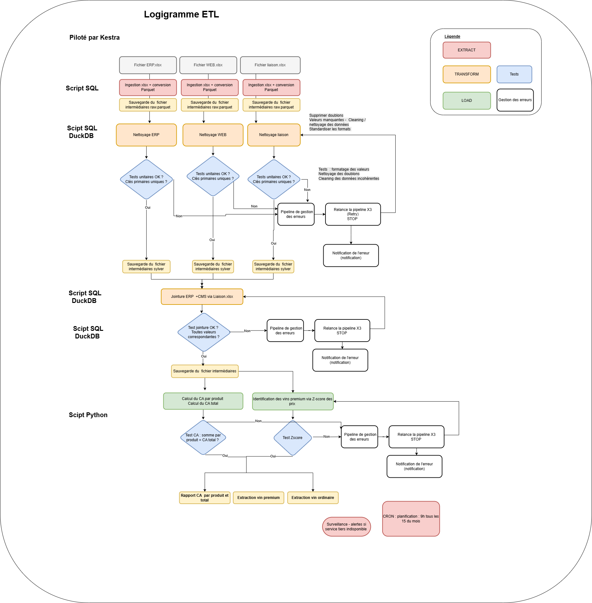

# OCR - Projet 10  
**Mise en place d’un pipeline d’orchestration de données avec Kestra**  
*Avril 2026*  

---

## Contexte du projet  
BottleNeck est un marchand de vin qui dispose de données provenant de deux systèmes :

- **ERP** : produits, stock, prix  
- **CMS** : ventes web  
Les données sont fournies sous forme de fichiers (Excel / Parquet) et doivent être :
- nettoyées  
- contrôlées  
- réconciliées  
- exploitées pour analyse  

---

## Objectifs

- calculer le chiffre d’affaires par produit  
- calculer le chiffre d’affaires total  
- identifier les vins premium (z-score / IQR)  
- produire des datasets exploitables pour analyse  

Aujourd’hui, les traitements sont manuels. L'objectif est d'automatiser toute la chaîne de traitement avec un pipeline data orchestré.

Solution mise en place : 
Mise en place d’un pipeline de données automatisé avec **Kestra** permettant de :
- orchestrer les étapes ETL  
- exécuter des contrôles qualité  
- transformer les données  
- produire des datasets exploitables  
- suivre les exécutions (logs + monitoring)  

---

## Structure du projet

```text
Projet_10/
├── data/
│   ├── raw/              # Données sources brutes (Fichier_erp.xlsx, Fichier_web.xlsx, fichier_liaison.xlsx)
│   ├── silver/           # Données après nettoyage et normalisation
│   ├── output/           # Datasets finaux (ca_produit.xlsx, vins_premium.csv, etc.)
│   └── tmp/              # Stockage temporaire des fichiers Parquet intermédiaires
│
├── flows/
│   └── etl_data_pipeline.yml   # Workflow Kestra complet (Extraction, Nettoyage, Fusion, Analyse)
│
├── presentation/         # Supports de présentation
├── .env                  # Variable d'environnement modificable
├── docker-compose.yml    # Orchestration Docker (Kestra + Postgres)
├── README.md             # Documentation
└── requirements.txt      # Dépendances Python
```

## Logigramme ETL
Le pipeline est structuré comme suit :



## Choix technologiques
Kestra : Kestra est un outil d’orchestration de pipelines de données qui permet de définir, automatiser et monitorer des workflows ETL de manière déclarative via du YAML.
DuckDB : SQL rapide sur fichiers (Parquet / Excel)
Python : logique métier et validations
Docker / Docker Compose : environnement reproductible local
Parquet : format optimisé pour performance et analyse

## Configuration de l'environnement

Le projet utilise un fichier `.env` pour centraliser la gestion des dossiers et des fichiers sources. Assurez-vous que votre fichier est configuré comme suit :

```env
# Dossiers
INPUT_PATH=data/raw/
OUTPUT_PATH=data/silver/

# Nom des fichiers
ERP_FILE=Fichier_erp.xlsx
WEB_FILE=Fichier_web.xlsx
LIAISON_FILE=fichier_liaison.xlsx
```

## Variables du Pipeline Kestra

Les chemins utilisés à l'intérieur du container Kestra sont mappés sur ces variables dans le flow `etl_data_pipeline.yml`. Voici la correspondance :

| Variable Kestra | Chemin interne (Container) | Description |
|---|---|---|
| `sourceerp` | `/app/data/raw/Fichier_erp.xlsx` | Source de données ERP |
| `sourceweb` | `/app/data/raw/Fichier_web.xlsx` | Source de données CMS (Web) |
| `sourceliaison` | `/app/data/raw/fichier_liaison.xlsx` | Table de correspondance |
| `tempDir` | `/app/data/tmp` | Fichiers Parquet temporaires |
| `outputDir` | `/app/data/output` | Résultats exportés |

## Installation et Démarrage

### 1. Prérequis

- Docker & Docker Compose (v2.0+)

### 2. Démarrage des services

Lancez l'infrastructure :

```bash
docker-compose up -d
```

Le container Kestra chargera automatiquement les fichiers présents dans `data/raw/` (définis par votre `INPUT_PATH`) pour exécuter le pipeline.

### 3. Acceder à l'interface : 

Accéder à l'interface Kestra: http://localhost:8080

### 4.Exécuter le pipeline

Manuelle:
UI Kestra → Flows → ocde_p10 → "Execute"

Automatique: Le pipeline s'exécute le 15e jour de chaque mois à 9h UTC.

### 5. Surveiller l'exécution
Logs en temps réel:
UI Kestra →  Dernière exécution → Logs

Statut des tâches:
Chaque tâche affiche: ✅ SUCCESS | ⚠️ WARNING | ❌ FAILED

### 6. Récupération des outputs

Après l'exécution, vous pouvez récupérer les résultats finaux directement depuis votre terminal local :

```bash
# Export du CA par produit
docker-compose cp kestra:/app/data/output/ca_produit.xlsx ./ca_produit.xlsx

# Export des vins classifiés
docker-compose cp kestra:/app/data/output/vins_premium.csv ./vins_premium.csv
docker-compose cp kestra:/app/data/output/vins_ordinaires.csv ./vins_ordinaires.csv
```


